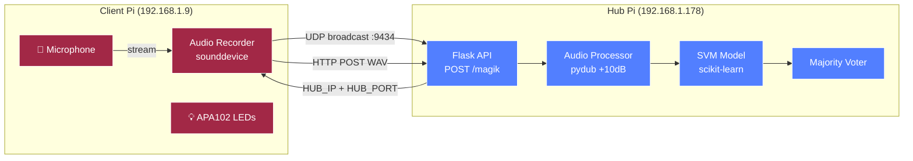

# 🍼 Fuss-o-meter

<div align="center">

[](https://www.python.org/)
[](https://flask.palletsprojects.com/)
[](https://scikit-learn.org/)
[](https://www.raspberrypi.org/)

*Is that baby up? 👶 Real-time baby cry detection on Raspberry Pi.*

</div>

---

## Table of Contents 📋

- [Overview](#overview-)
- [Features](#features-)
- [Architecture](#architecture-)
- [Prerequisites](#prerequisites-)
- [Quick Start](#quick-start-)
- [Project Structure](#project-structure-)
- [Configuration](#configuration-)
- [ML Training](#ml-training-)
- [Deployment](#deployment-)
- [Monitoring & Logging](#monitoring--logging-)
- [Troubleshooting](#troubleshooting-)

---

## Overview 🎯

Fuss-o-meter is a distributed, real-time baby cry detection system running on Raspberry Pi hardware. A **client** Pi listens via microphone and ships audio clips over the local network to a **hub** Pi. The hub processes audio through a pre-trained SVM model and determines whether the baby is fussing — no cloud, no subscriptions, just LAN and Python.

## Features ✨

- **Real-time detection** — Continuous audio capture and ML classification
- **UDP auto-discovery** — Client finds the hub automatically on the LAN; no static IPs needed at runtime
- **ML-powered** — SVM classifier trained on 44.1 kHz audio with librosa feature extraction
- **Distributed architecture** — Separate client and hub devices, each with their own service
- **LED feedback** — APA102 DotStar LED animations on the client indicate device state
- **Systemd integration** — Auto-start services survive reboots on both devices
- **Environment-aware logging** — `DEV` / `CASUAL` / `PROD` log level profiles

## Architecture 🏗️



### Data Flow

1. **Discovery** — Client broadcasts `pfg_ip_broadcast_cl` on UDP port `9434`. Hub responds with its IP and dynamically assigned port.
2. **Recording** — Client records a WAV (44.1 kHz, 2-ch, configurable duration) and queues it.
3. **Transmission** — Client POSTs the WAV file to `POST /magik` on the hub Flask API.
4. **Processing** — Hub amplifies audio +10 dB via pydub and enqueues for inference.
5. **Inference** — `Predictomatica` runs the SVM model over 5 overlapping 5-second windows.
6. **Voting** — `MajorityVoter` returns `1` (baby crying) if more than half of windows predict a cry.

### Components

| Component | Description |
|-----------|-------------|
| 🎤 Microphone | Records 44.1 kHz, 2-channel WAV via `sounddevice` |
| 🔍 UDP Discovery | Broadcast on port `9434`; hub responds with connection info |
| 🌐 Flask API | Hub endpoint `POST /magik` receives audio and queues for inference |
| 🔊 Audio Processor | pydub amplifies WAV +10 dB before inference |
| 🤖 SVM Model | scikit-learn pipeline (StandardScaler → SVC) trained on 18 audio features |
| 🗳️ Majority Voter | Aggregates 5 per-window predictions into a single cry / no-cry verdict |
| 💡 APA102 LEDs | SPI-driven DotStar LED strip (3 pixels) reflecting device state |

## Prerequisites 📋

- Python >= 3.7
- Two Raspberry Pi devices on the same LAN
- SPI enabled on the client Pi (`sudo raspi-config` → Interface Options → SPI)
- PortAudio: `sudo apt-get install libportaudio2`
- ffmpeg (for pydub): `sudo apt-get install ffmpeg`
- Pre-trained `model.pkl` in `src/hub/model/` (see [ML Training](#ml-training-))

## Quick Start 🚦

### 1. Clone and configure

```bash
git clone <repo-url>
cd fuss-o-meter
cp example.env .env
# Edit .env — see Configuration section
```

### 2. Install dependencies

```bash
# Hub
pip3 install -r src/hub/requirements.txt

# Client
pip3 install -r src/client/requirements.txt
```

### 3. Train or place a model

See [ML Training](#ml-training-) or drop a pre-trained `model.pkl` into `src/hub/model/`.

### 4. Deploy to Raspberry Pi devices

```bash
bash hub-deploy.sh      # deploys hub to 192.168.1.178
bash client-deploy.sh   # deploys client to 192.168.1.9
```

### 5. Install and start systemd services

**Hub Pi:**

```bash
sudo cp src/hub/systemd_service/fom-hub.service /etc/systemd/system/
sudo systemctl enable fom-hub && sudo systemctl start fom-hub
```

**Client Pi:**

```bash
sudo cp src/client/systemd_service/fuss-o-meter.service /etc/systemd/system/
sudo systemctl enable fuss-o-meter && sudo systemctl start fuss-o-meter
```

## Project Structure 🗂️

```text
fuss-o-meter/
├── src/
│   ├── hub/                          # Hub service (prediction server)
│   │   ├── service.py                # Entry point — threads + Flask startup
│   │   ├── requirements.txt
│   │   ├── model/                    # Trained model artifacts (gitignored)
│   │   ├── systemd_service/          # fom-hub.service
│   │   └── helpers/
│   │       ├── audio.py              # WAV volume amplification via pydub
│   │       ├── configs.py            # Flask config classes (dev/casual/prod)
│   │       ├── discovery.py          # UDP broadcast listener
│   │       ├── flask_api.py          # Routes: POST /magik
│   │       ├── local_ops.py          # Temp file management
│   │       ├── logger.py             # Env-aware logging
│   │       ├── ports.py              # Free TCP port finder
│   │       ├── queues.py             # Inbound + UpdatedWave queues
│   │       ├── startup.py            # dotenv loader + port assignment
│   │       ├── threads.py            # Thread termination utilities
│   │       └── baby_detection/
│   │           ├── make_prediction.py        # Predictomatica orchestrator
│   │           └── helpers/
│   │               ├── __init__.py           # Reader (audio file loader)
│   │               ├── baby_cry_predictor.py # SVM wrapper
│   │               ├── feature_engineer.py   # librosa feature extraction
│   │               └── majority_voter.py     # Majority vote aggregator
│   └── client/                       # Client service (audio capture)
│       ├── service.py                # Entry point — mic + queue thread
│       ├── requirements.txt
│       ├── systemd_service/          # fuss-o-meter.service
│       └── helpers/
│           ├── api_requests.py       # HTTP POST to hub /magik
│           ├── discovery.py          # UDP broadcast sender
│           ├── local_ops.py          # Temp file management
│           ├── logger.py             # Env-aware logging
│           ├── microphone.py         # Audio recording via sounddevice
│           ├── queues.py             # Outbound + StreamData queues
│           ├── startup.py            # dotenv loader
│           └── LEDs/
│               ├── controller.py     # LED state machine (wakeup/listen/think/speak/off)
│               └── driver/
│                   └── apa102.py     # SPI driver for APA102 DotStar strip
├── baby_detection_ml/                # Offline ML training pipeline
│   ├── requirements.txt
│   ├── record_me.py                  # Utility: record custom training samples
│   ├── data/
│   │   └── 301 - Crying baby/        # Labeled audio samples (.ogg, .wav)
│   └── training/
│       ├── train_set.py              # Feature engineering → .npy dataset
│       ├── train_model.py            # SVM training → model.pkl
│       └── methods/
│           ├── __init__.py           # Reader (training audio loader)
│           ├── feature_engineer.py   # librosa feature extraction
│           └── train_classifier.py   # SVM + GridSearchCV pipeline
├── docs/templates/readme-template.md
├── example.env
├── hub-deploy.sh
└── client-deploy.sh
```

## Configuration ⚙️

Copy `example.env` to `.env` on both Pi devices before deploying.

```bash
APP=fuss-o-meter       # Application name (used by logger)
VERSION=1.2            # Application version
ENV=casual             # Environment: dev | casual | prod

MODEL_DIR=model        # Model directory, relative to hub working dir
PREDICTIONS_DIR=predictions  # Reserved for future use

REC_DURATION=10        # Microphone recording duration in seconds
POST_ENDPOINT=/magik   # Hub API endpoint for audio uploads
```

> `HUB_IP` and `HUB_PORT` are set **automatically at runtime** via UDP discovery — do not configure them manually.

### Log Levels

| `ENV` | Log Level |
|-------|-----------|
| `DEV` | `DEBUG` |
| `CASUAL` | `INFO` |
| `PROD` | `ERROR` |

## ML Training 🤖

### 1. (Optional) Record custom training samples

```bash
python3 baby_detection_ml/record_me.py
```

Saves 5-second WAV clips to `baby_detection_ml/data/007 - bspeagle/`.

### 2. Build the feature dataset

Run from the repo root:

```bash
cd baby_detection_ml/training
python3 train_set.py
```

Output: `baby_detection_ml/output/dataset/dataset.npy` + `labels.npy`

### 3. Train the SVM model

```bash
python3 train_model.py
```

Output (written to `src/hub/model/`):

- `model.pkl` — pickled scikit-learn pipeline
- `performance.json` — accuracy, recall, precision, F1
- `parameters.json` — best GridSearchCV parameters

### Feature Extraction

18 features extracted per audio window at 44.1 kHz (frame size: 512 samples):

| Feature | Dimensions |
|---------|-----------|
| Zero Crossing Rate | 1 |
| RMS Energy | 1 |
| MFCC | 13 |
| Spectral Centroid | 1 |
| Spectral Rolloff | 1 |
| Spectral Bandwidth | 1 |

The classifier uses a `StandardScaler → SVC` pipeline tuned via 10-fold `GridSearchCV` over `linear` / `rbf` kernels.

## Deployment 🚀

Update the target IPs in the deploy scripts if your network differs:

| Script | Device | Default IP |
|--------|--------|------------|
| `hub-deploy.sh` | Hub Pi | `192.168.1.178` |
| `client-deploy.sh` | Client Pi | `192.168.1.9` |

Each script zips the relevant `src/` subdirectory + `.env`, SCPs it to `/home/pi/fom`, and unpacks it. Python deps must be installed separately on each Pi.

## Monitoring & Logging 📊

Log format: `%(module)s: %(funcName)s: %(levelname)s: %(message)s`

```bash
# Live hub logs
sudo journalctl -u fom-hub -f

# Live client logs
sudo journalctl -u fuss-o-meter -f
```

## Troubleshooting 🔍

### Common Issues

1. **Hub not found / discovery timeout**
   - Confirm both Pis are on the same LAN subnet
   - Check UDP port `9434` is not firewalled
   - Verify hub is running: `sudo systemctl status fom-hub`

2. **`model.pkl` not found on hub startup**
   - Run the training pipeline to generate the model
   - Confirm `MODEL_DIR=model` matches the directory under `src/hub/`

3. **Microphone not recording**
   - List available devices: `python3 -m sounddevice`
   - Ensure PortAudio is installed: `sudo apt-get install libportaudio2`

4. **APA102 LEDs not responding**
   - Enable SPI: `sudo raspi-config` → Interface Options → SPI
   - APA102 uses SPI bus `0`, device `1` (CS1) — check wiring

5. **pydub audio conversion errors**
   - Install ffmpeg: `sudo apt-get install ffmpeg`

---

<div align="center">

**[ [Back to Top](#-fuss-o-meter) ]**

</div>
